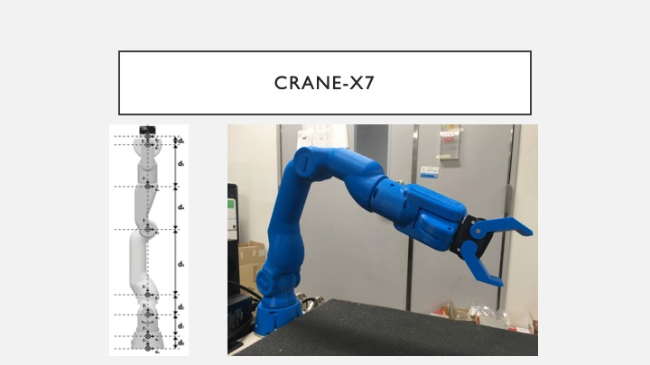
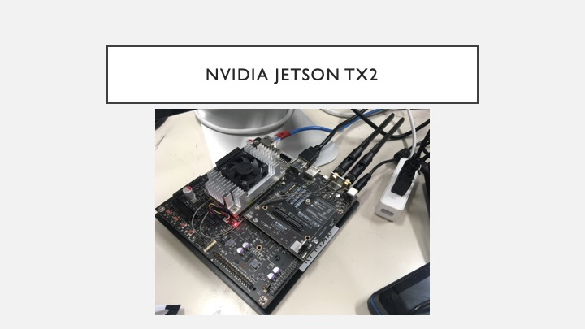
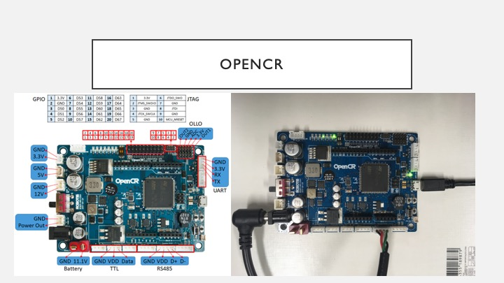
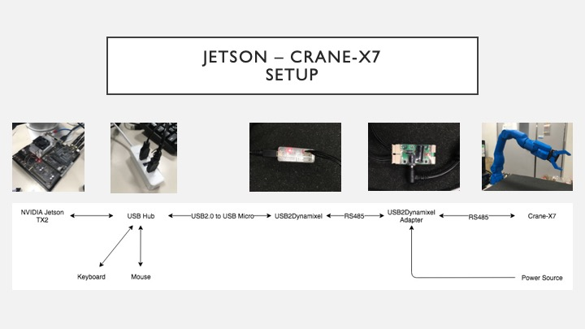
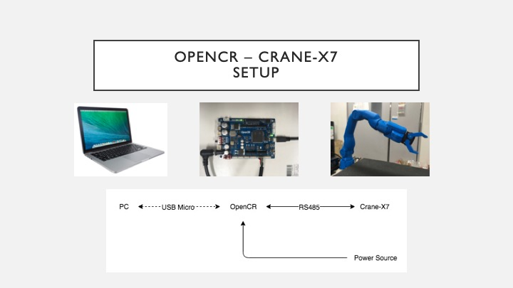
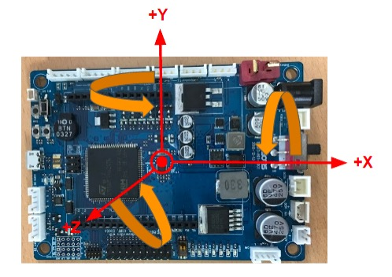
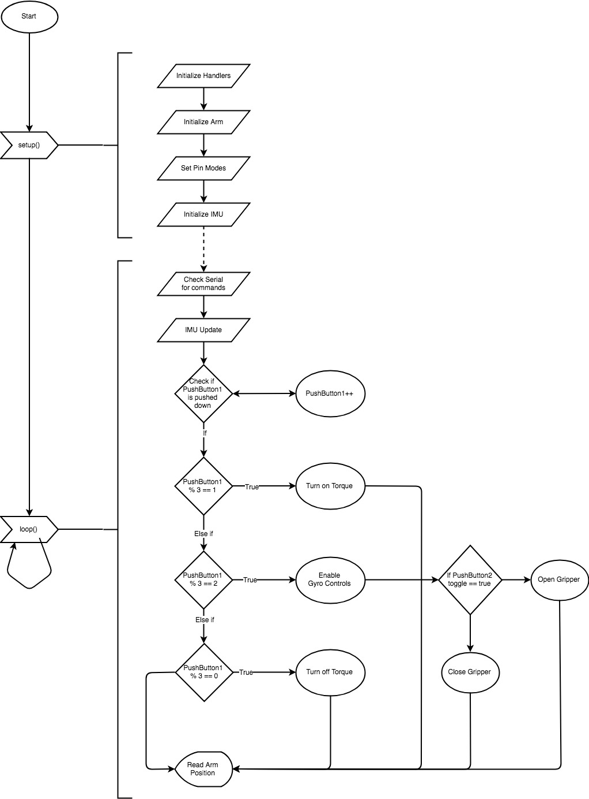
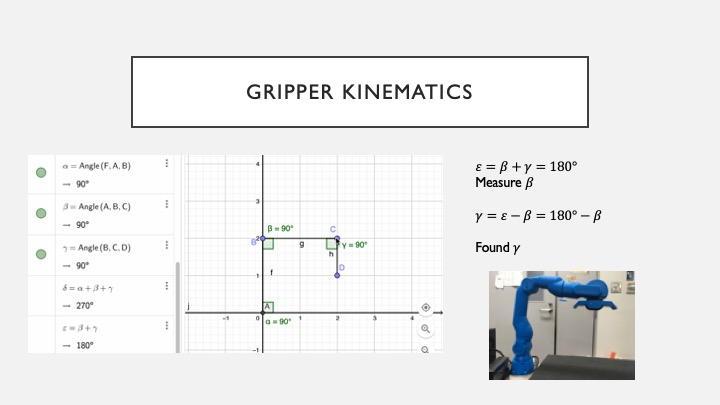
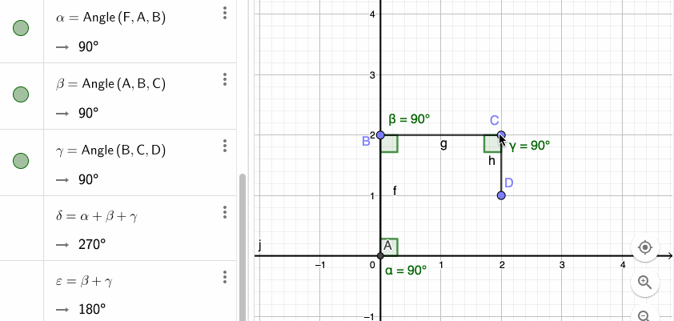
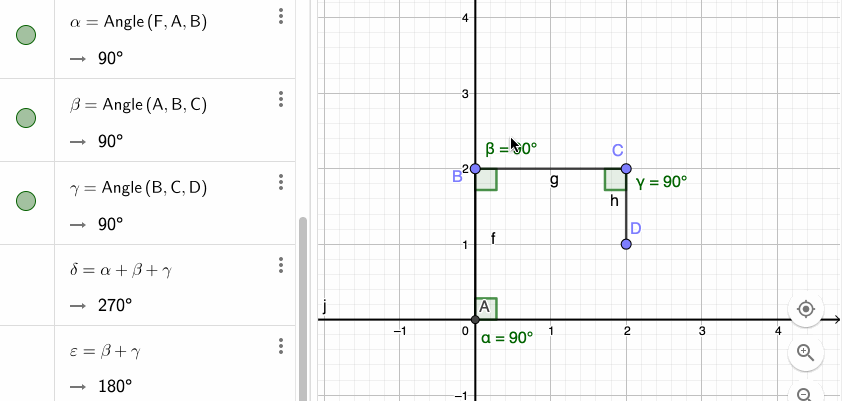

# Frontier Lab Research at Osaka, Japan

Upon my arrival at the Hosoda Laboratory in Osaka Univerity, Japan, I was introduced to a seven-degrees-of-freedom robotic arm called the Crane-X7. However, the current system to power and run the robotic arm was physically too big, its software requirements too strict, and requires too many adapters. My Goal at Hosoda Laboratory was to explore new ways to reduce the current system(The NVIDIA Jetson TX2) requirements for something more lightweight and portable, and create new features for future implementations. In the end, I was able to provide an alternative way to power and run the Crane-X7 by swapping the more desktop orientated Jetson TX2 with a more portable, more cost effective, all-in-one microcontroller called the OpenCR.

Technology Used:
* OpenCR
* CRANE-X7
* Arduino IDE
* Dynamixel SDK Library

## The CRANE-X7 by RT CORPORATION.

### The Goal:

Replace the NVIDIA Jetson TX2 with OpenCR:

Thus reducing the overall system from this:

to this:

OpenCR also comes with many built-in features like IMU, buttons, and LEDs.
I built a fun program that demonstrates the new features made possible thanks to the OpenCR. The IMU allowed me to control the arm, the buttons allowed me to open/close the gripper, and the on-board LEDs displayed important notifications.

<!--  -->

[Karaage in Cup](https://youtu.be/N_jZu9cy7EY)

[Pouring a Drink](https://youtu.be/JTcfXIpT0VU)
<!--  -->

<!--  -->
[XYZ Axis Demo](https://youtu.be/GwmOkOydiBY)

How XYZ Axis is defined:

### Here are some technical stuff about the program:

The Flow Chart:

I limited my program to two joints to simplify the gripper kinematics but it severely restricted its movement range. Expanding it beyond two joints can be a future addition.

One joint:

Two joint:

### Here is the full process from start to end:

